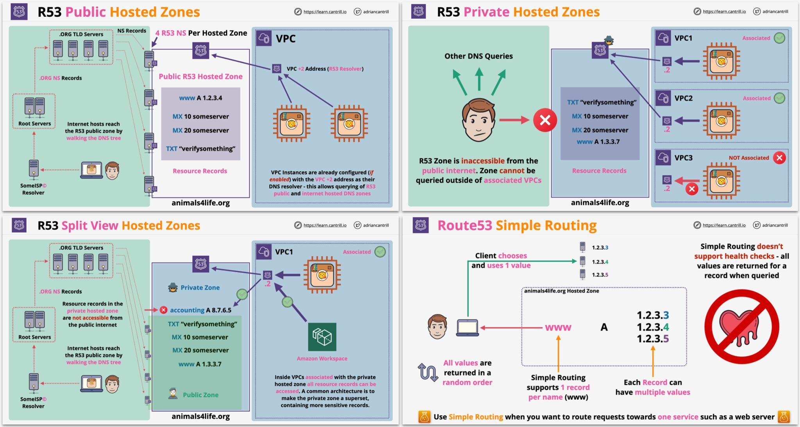

# Current progress

App Gw deployment with bicep is tested with already existing Public IP, DNS Zone, Vnet. 

Note that deployments/customers/deploy.cli.ps1 is also configured to deploy Public IP, DNS Zone, Vnet via `make customers` so that we can test bicep deployment of app-gw with `make customers-bicep`. 

# Todo

Left to do is to implement all other deployment files in deployments/customers-bicep - and what parameters to use to configure this resources look at ps1 deployment files in deployments/customers.

Follow `az.04B.deploy.application-gateway.*.bicep` files to know how to work with biceps files. 

Use layers such that we have main template layer, composed layers and resource layers. 

### Layer 1 - main deployment

azuredeploy.bicep will have all parameters and variables for deployment, beside those unique for deployment that has to be provided from command line.

### Layer 2 - composed deployment

main layer will call bunch of composed deployments with prepared forms for specific cases, ie. az.04B.deploy.application-gateway.customers.bicep 

This layer may call other composed deployments or resource deployments.

### Layer 3 - resource (bottom) deployment

finally az.04B.deploy.application-gateway.customers.bicep will call az.04B.deploy.application-gateway.bicep that is resource declaration provided by microsoft 'Microsoft.Network/applicationGateways@2020-11-01'

This layer should be last layer of nested deployment in this branch.

# Todo List

[ ] - rewrite powershell deployments/customers to deployments/customers-bicep
[ ] - rewrite powershell deployments/customer to deployments/customer
[ ] - reconfigure script for auto updating of app gw backend pool servers at ACI ip changes

##

# Development

1. Follow that [local file](./azure-how-to/Setup-service-principal-for-whole-subscription.md)
2. Copy .env.secrets-TEMPLATE to .env.secrets 
3. Fill in .env.secrets based on 1.


Pod qous:
https://kubernetes.io/docs/tasks/configure-pod-container/quality-service-pod/#:~:text=For%20a%20Pod%20to%20be,they%20must%20be%20the%20same.

``
apiVersion: v1
kind: Pod
metadata:
  name: qos-demo
  namespace: qos-example
spec:
  containers:
  - name: qos-demo-ctr
    image: nginx
    resources:
      limits:
        memory: "200Mi"
        cpu: "700m"
      requests:
        memory: "200Mi"
        cpu: "700m"
        ```

jak sie zachowaja pody gdy dla deploymentu persistent volume gdy zwiekszymy ilosc replik z 1 do 3

beda chcialy 

czy mozliwy jest restart nginxa w kontenerze poda


```sh
# deploy internal resources needed by customers deployments: ARG, ACR, AKV
make internal
# deploy multi-tenant resources: ARG, AVN (+ subnets), ASG, API, ADZ, ACI, AAG
make customers
# deploy specific tenante resouces: ACI, AMySQL
# claim subnet from AVN
# claim slot from AAG 
# add ACI to AAG Backend Pool
make customer
```

> NOTE: as its demo customers deployment here is only for 10 slots when 100 is limit dictated by one AAG limits.


# Usefull stuff

## Azure 

## Powershell Jobs

[Get-Job (Microsoft.PowerShell.Core) - PowerShell](https://docs.microsoft.com/en-us/powershell/module/microsoft.powershell.core/get-job?view=powershell-7.1)
[Receive-Job (Microsoft.PowerShell.Core) - PowerShell](https://docs.microsoft.com/en-us/powershell/module/microsoft.powershell.core/receive-job?view=powershell-7.1)

NOTE: it seems we can not preserve job easily between sesions.

## Null coalescing

```ps1
PS /home/robert> $null ?? 100
100
```

## DNS Zones

